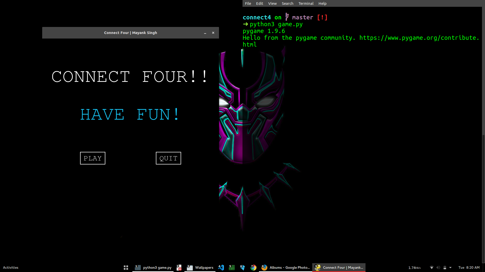
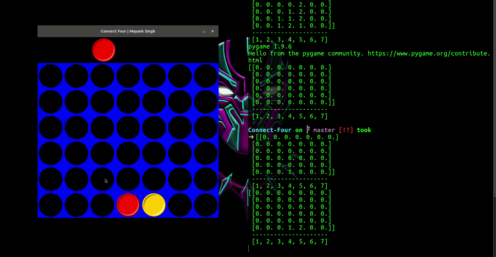

<div align="center">
<p>
  
</p>

[](https://github.com/code-monk08/connect-four/issues)  [](https://github.com/code-monk08/connect-four/network/members)  [](https://github.com/code-monk08/connect-four/stargazers)          [](https://twitter.com/intent/follow?screen_name=codemonk08_)  [](https://telegram.me/codemonk08)
</div>

## :ledger: Index

- [About](#beginner-about)
- [Usage](#zap-usage)
  - [Installation](#electric_plug-installation)
  - [Commands](#package-commands)
- [File Structure](#file_folder-file-structure)
- [Guideline](#exclamation-guideline)  
- [Resources](#page_facing_up-resources)
- [Gallery](#camera-gallery)
- [Credit/Acknowledgment](#star2-creditacknowledgment)
- [License](#lock-license)

##  :beginner: About
Connect Four is a two-player connection game in which the players first choose a color and then take turns dropping one colored disc from the top into a seven-column, six-row vertically suspended grid. The pieces fall straight down, occupying the lowest available space within the column. The objective of the game is to be the first to form a horizontal, vertical, or diagonal line of four of one's own discs.

## :zap: Usage
To use this project.

###  :electric_plug: Installation
- Install dependencies & export environment variables.

```bash
$ sudo -H pip3 install -r requirements.txt
```
###  :package: Commands
- Start project using
```bash
$ python3 game.py
```

##  :file_folder: File Structure
- Add a file structure here with the basic details about files, below is an example.

```
.
├── assets.py
├── config.py
├── connect_game.py
├── events.py
├── game_board.py
├── game_data.py
├── game_renderer.py
├── game.py
├── images
│   ├── blackball91px.png
│   ├── logo
│   │   └── connect4.png
│   ├── redball90px.png
│   ├── screenshots
│   │   ├── 1.png
│   │   └── 2.gif
│   └── yellowball90px.png
├── LICENSE
├── README.md
├── requirements.txt
├── restart.sh
└── sounds
    ├── disc_drop_1.wav
    ├── disc_drop_2.wav
    └── event.ogg

4 directories, 21 files

```

| No | File Name          | Details 
|----|--------------------|-------------------------------------------------------------------------------------|
| 1  | assets.py          | used for loading sound and image files in python.
| 2  | config.py          | contains game's configuration settings.
| 3  | connect_game.py    | Contains the ConnectGame class which holds the logic for the whole game.
| 4  | events.py          | Contains classes used to define and hold event data.
| 5  | game_board.py      | Contains the GameBoard data structure and methods which operate on it.
| 6  | game_data.py       | Contains the GameData class, which contains all of the data in the game.
| 7  | game_renderer.py   | Holds the GameRenderer class, which renders the game state using sound and graphics.
| 8  | game.py            | contains connect four game logic.
| 9  | images/            | contains image resources used in the game.
| 10 | images/logo        | contains logo used in the README.
| 11 | images/screenshots | contains game screenshots.
| 12 | LICENSE            | this project uses MIT License.
| 13 | requirements.txt   | contains all the dependencies used in the game.
| 14 | restart.sh         | bash script to relaunch the game once it is finished.
| 15 | sounds/            | contains sound resources used in the game.

##  :exclamation: Guideline

- __Code Style__

### `black`
In order to maintain the code style consistency across entire project I use a code formatter. I kindly suggest you to do the same whenever you push commits to this project. 

The python code formatter I chose is called Black. It is a great tool and it can be installed quickly by running 

```bash
sudo -H pip3 install black
```

or

```bash
python3.6 -m pip install black
```

It requires Python 3.6.0+ to run.

- __Usage__

```bash
black {source_file_or_directory}
```

For more details and available options, please check their [psf/black](https://github.com/psf/black).

### `isort`
I also use isort, it is a Python utility / library to sort imports alphabetically, and automatically separated into sections. It provides a command line utility which can be installed using.

```bash
sudo -H pip3 install isort 
```

- __Usage__

```bash
isort {source_file}.py
```

For more details and available options, please check their [timothycrosley/isort](https://github.com/timothycrosley/isort).


- __Close Issues__

Close issues using keywords: [how to ?](https://help.github.com/en/articles/closing-issues-using-keywords)

##  :page_facing_up: Resources
- [PyGame Documentation](https://www.pygame.org/docs/) : Pygame is a cross-platform set of Python modules designed for writing video games. It includes computer graphics and sound libraries designed to be used with the Python programming language.

##  :camera: Gallery
<p align="center">
  
</p>

<p align="center">
  
</p>

## :star2: Credit/Acknowledgment
[](https://github.com/code-monk08/connect-four/graphs/contributors)

##  :lock: License
[](https://github.com/code-monk08/connect-four/blob/master/LICENSE)
